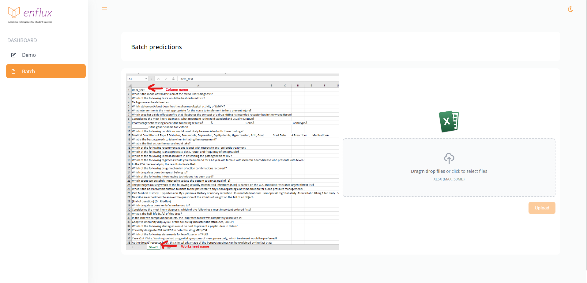

# Enflux AI Machine Learning Project

  

    <em>FastAPI framework, high performance, easy to learn, fast to code, ready for production</em>

---

## Modules

- Frontend built with React
- Backend-1 built with custom TFPOS-IDF vectorizer
- Backend-2 built with LSTM model

### Interactive API docs

Now go to <a href="https://enflux-api.herokuapp.com/docs" class="external-link" target="_blank">https://enflux-api.herokuapp.com/docs</a>.

You will see the automatic interactive API documentation (provided by <a href="https://github.com/swagger-api/swagger-ui" class="external-link" target="_blank">Swagger UI</a>):

